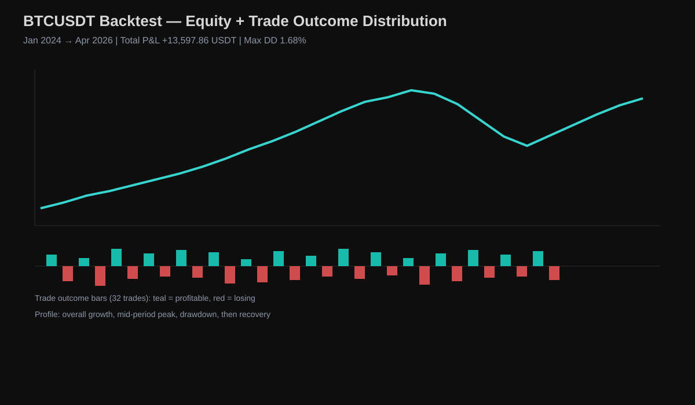
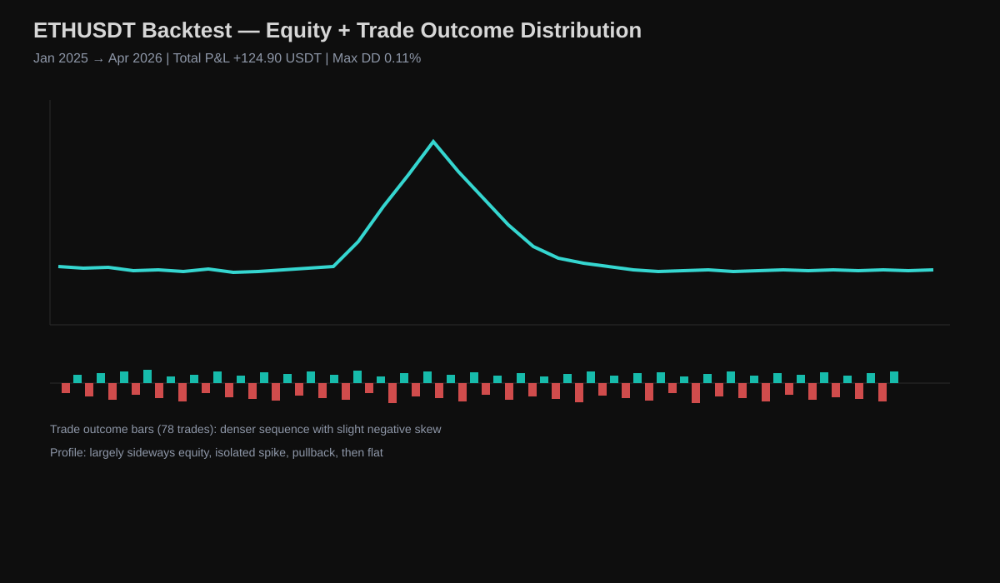
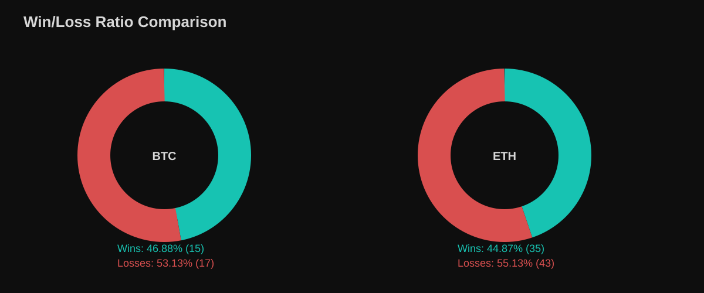

# Bullish Fib GZ + FVG Strategy [1:4 RR]

A rule-based Smart Money Concepts strategy engineered to target asymmetric upside through disciplined 1:4 risk-to-reward execution.

## About the Strategy

This project provides a **TradingView Pine Script strategy** built around confluence-driven long entries. It combines:

- **Fibonacci Golden Zone** retracement (**0.618–0.660**)
- **Fair Value Gap (FVG)** overlap confirmation
- **Breaker Block** rejection filter

The objective is to capture structured pullback entries with strict risk control and a high **1:4 RR** target framework.

## Strategy Logic

**Pine Script Version:** v5  
**Strategy:** Bullish Fibonacci Golden Zone + Fair Value Gap  
**Filter:** Breaker Block  
**Risk:Reward:** 1:4

**Execution logic:**

1. Detect a bullish swing structure (low → high).
2. Wait for retracement into the Fibonacci 0.618–0.660 Golden Zone.
3. Validate entry only if an FVG overlaps the retracement area.
4. Reject the setup if a breaker block is present in the entry path.
5. Enter long on confirmed confluence.
6. Place stop-loss below the swing low.
7. Set take-profit at 1:4 RR.

## How It Was Tested

- **Platform:** TradingView Strategy Tester
- **Method:** Historical backtest
- **Markets and windows:**
  - **BTCUSDT:** January 2024 → April 2026
  - **ETHUSDT:** January 2025 → April 2026

## How to Use

1. Open TradingView and load a BTCUSDT or ETHUSDT chart.
2. Open the Pine Editor and paste the strategy code from `main.pine`.
3. Save and add the strategy to chart.
4. Configure risk settings, session preferences, and position sizing.
5. Run the Strategy Tester and evaluate P&L, drawdown, and trade distribution.
6. Forward test in paper mode before any live deployment.

## Results Section

### BTCUSDT Backtest (Jan 2024 → Apr 2026)

| Metric | Value |
|---|---:|
| Total P&L | **+13,597.86 USDT (+1.36%)** |
| Max Drawdown | 17,226.13 USDT (1.68%) |
| Total Trades | 32 |
| Wins | 15 (46.88%) |
| Losses | 17 (53.13%) |
| Profit Factor | 1.348 |
| Avg Profit | 4.58% |
| Avg Loss | -2.62% |

### ETHUSDT Backtest (Jan 2025 → Apr 2026)

| Metric | Value |
|---|---:|
| Total P&L | **+124.90 USDT (+0.01%)** |
| Max Drawdown | 1,061.80 USDT (0.11%) |
| Total Trades | 78 |
| Wins | 35 (44.87%) |
| Losses | 43 (55.13%) |
| Profit Factor | 1.046 |
| Avg Profit | 3.21% |
| Avg Loss | -2.08% |

### Win/Loss Composition

## Why Use This Strategy

- Built on practical **Smart Money Concepts** conditions rather than single-indicator signals.
- Uses a **multi-confirmation** process (Fib zone + FVG + breaker block filter).
- Maintains a strict **1:4 RR** framework for asymmetric payoff.
- Designed to remain viable even with a sub-50% win rate.
- Validated through historical backtesting across BTC and ETH samples.

## Code Section

- Built in **Pine Script v5** for TradingView.
- Modular logic that can be customized for market, timeframe, and risk model.

## Download Section

## Footer

If this project helps your research workflow, consider starring the repository to support future updates.

This strategy is provided for educational and research purposes only and does not constitute financial advice.
